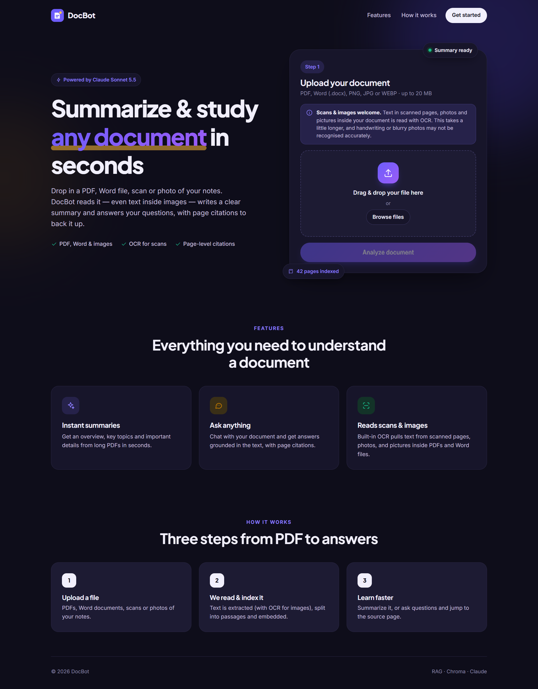
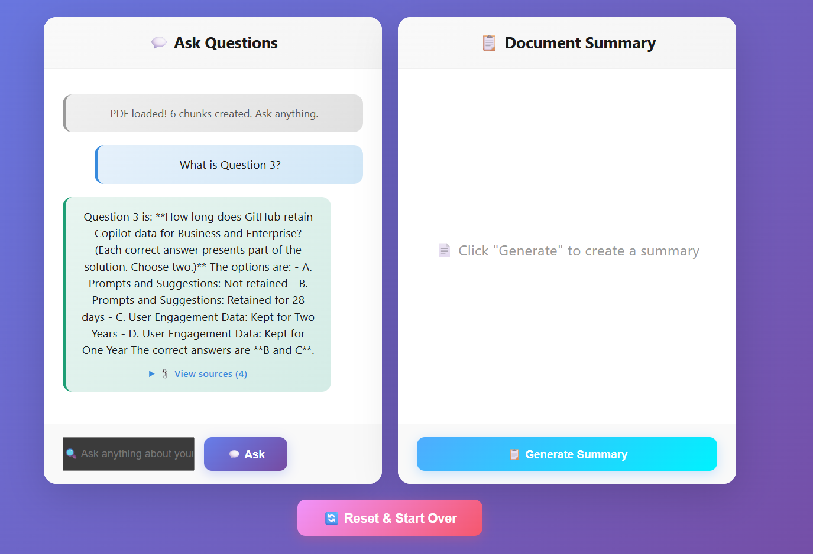
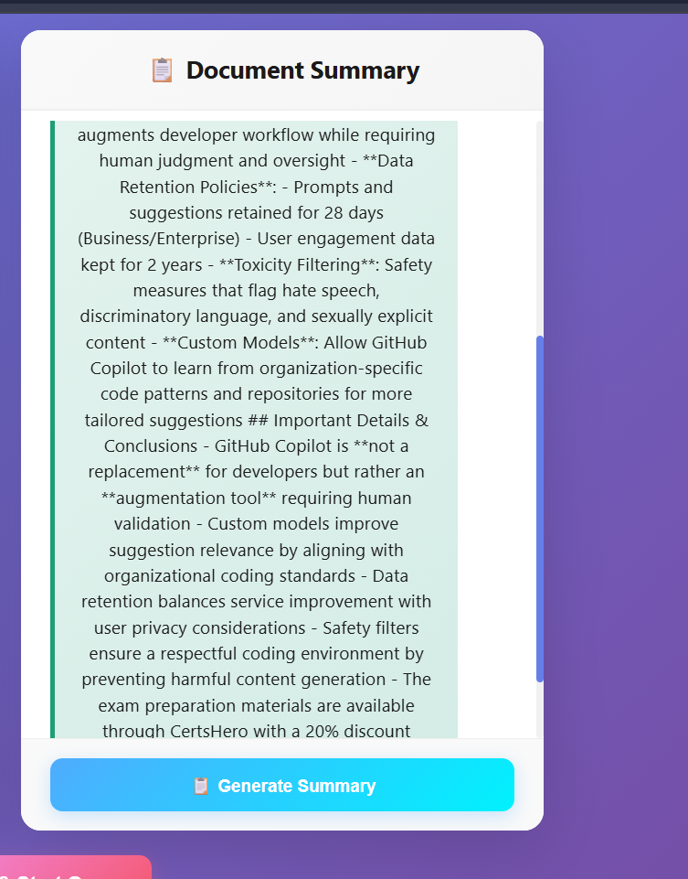

# DocumentChatBot / QABot

A full-stack document Q&A application that lets users upload PDFs, Word documents or images, extract their text (with OCR for scans and pictures), store the content in a vector database, and then ask questions about the document.

## Features

- Upload PDF, Word (.docx) and image (PNG, JPG, WEBP) files
- Extract text, including **OCR** for scanned PDF pages, images embedded in PDFs/DOCX, and photos
- Index document content for semantic search
- Ask questions about the uploaded document
- Generate a document summary
- Modern React frontend with a FastAPI backend
- Input validation on both client and server (file type/signature, size, page count, question length)
- Unit and integration test suites for backend and frontend

## Screenshots

Here are some screenshots of the application in action:

### 1. Document Upload & Processing


### 2. Asking Questions


### 3. Document Summary


## Tech Stack

- Backend: FastAPI, Uvicorn, Python
- Frontend: React + Vite
- Vector search: Chroma + sentence-transformers
- LLM: Claude Sonnet 5.5 via the official `anthropic` Python SDK
- Extraction: pdfplumber (PDF), python-docx (Word)
- OCR: RapidOCR (ONNX models bundled with the pip package — no Tesseract or system install needed)

## Project Structure

```text
DocumentChatBot/
├── DEPLOYMENT.md
├── render.yaml
├── qabot/
│   ├── backend/
│   │   ├── main.py
│   │   ├── requirements.txt
│   │   └── wsgi.py
│   └── frontend/
│       └── frontend/
│           ├── package.json
│           ├── src/
│           └── vite.config.js
└── chroma_db/
```

## Prerequisites

- Python 3.10+ (recommended 3.11)
- Node.js 18+
- An Anthropic API key ([console.anthropic.com](https://console.anthropic.com))

## Backend Setup

1. Navigate to the backend folder:

```bash
cd qabot/backend
```

2. Create and activate a virtual environment:

```bash
python -m venv .venv
.venv\Scripts\activate
```

3. Install dependencies:

```bash
pip install -r requirements.txt
```

4. Create a `.env` file with your API key (see `.env.example`; `CLAUDE_API_KEY` is also accepted):

```env
ANTHROPIC_API_KEY=your_anthropic_api_key
```

5. Start the backend server:

```bash
python -m uvicorn main:app --reload
```

The backend will be available at:

- http://localhost:8000

## Frontend Setup

1. Navigate to the frontend folder:

```bash
cd qabot/frontend/frontend
```

2. Install dependencies:

```bash
npm install
```

3. Start the development server:

```bash
npm run dev
```

The frontend will be available at:

- http://localhost:5173

## Validation Rules

| Check | Limit |
|---|---|
| File type | `.pdf`, `.docx`, `.png`, `.jpg`/`.jpeg`, `.webp` — extension, MIME type and file signature must agree (legacy `.doc` gets a "save as .docx" message) |
| File size | 20 MB (`MAX_UPLOAD_MB`) |
| Pages | 300 per PDF (`MAX_PDF_PAGES`) |
| Images | Max ~50 megapixels (decompression-bomb guard) |
| OCR work | 60 scanned pages/embedded images per upload (`MAX_OCR_ITEMS`); the UI reports any that were skipped |
| Text | Files with no readable text even after OCR are rejected with a clear message |
| Question | 2–2000 characters after trimming |

## How OCR Works

- **PDF:** pages with (almost) no text layer are rendered at 200 DPI and OCR'd. On normal text pages, embedded images such as diagrams, charts and screenshots are OCR'd too, and their text is appended to the page. Full-page images on pages that already have text (searchable scans) are skipped, so text isn't duplicated.
- **DOCX:** paragraphs, tables and inline images are read in document order. Since Word files have no fixed pages, text is grouped into numbered *sections* for citations.
- **Images:** phone-photo rotation (EXIF) is corrected, then the whole image is OCR'd.
- OCR'd passages are tagged, so answers and sources show an **OCR** badge. Claude is told the text came from OCR and mentions recognition errors only when the text looks garbled.
- Handwriting and blurry photos are recognised less reliably than printed text.
- The embedding model and OCR engine load in the background at startup, so the first upload isn't slow. Set `PRELOAD_MODELS=0` to disable this.

The frontend checks the same rules for instant feedback; the backend re-validates everything.

## Running Tests

Backend (no API key or network needed; Claude and the vector store are faked):

```bash
cd qabot/backend
pip install -r requirements-dev.txt
python -m pytest
```

Frontend (Vitest + Testing Library):

```bash
cd qabot/frontend/frontend
npm test
```

## Usage

1. Open the frontend in your browser.
2. Upload a PDF, Word document or image.
3. Wait for the document to be processed.
4. Ask questions related to the uploaded document.
5. Use the summary feature to get a quick overview of the document.

## Deployment

Deployment instructions for Render are available in [DEPLOYMENT.md](DEPLOYMENT.md).

The repository also includes a Render config file at [render.yaml](render.yaml).

## Notes

- Uploaded document content is stored locally in the Chroma database folder during development.
- With both models loaded, the backend uses roughly 600 MB of RAM, which exceeds Render's 512 MB free tier. Use an instance with at least 1 GB.
- For production, you may want to switch to a more persistent vector storage solution.
- Make sure your backend CORS settings allow your frontend origin when deploying.
